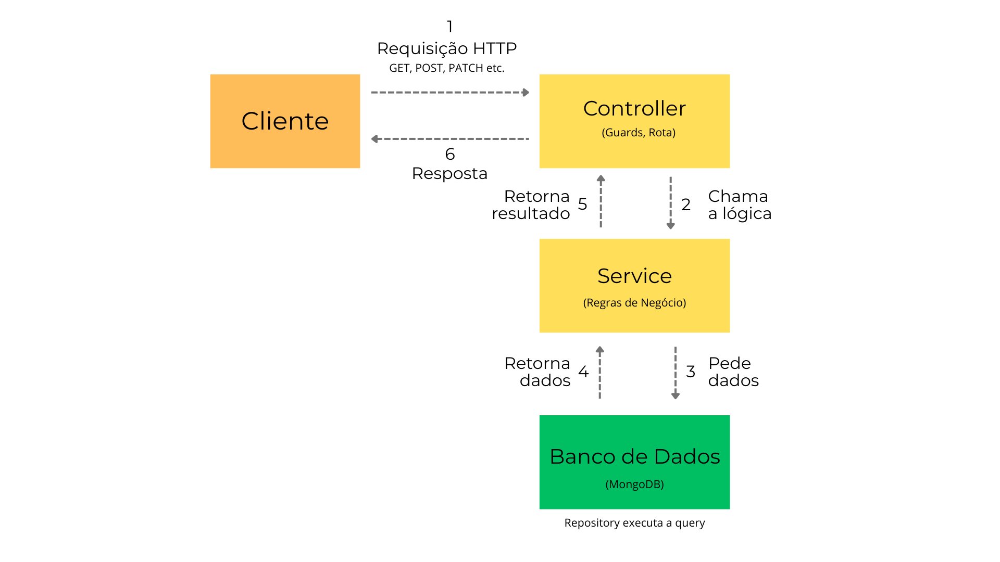
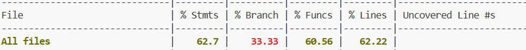

# Blog Education API

# 📘 Blog Education API — Documentação da Aplicação

## Introdução

O Blog Education API é o backend para uma plataforma de blog educacional. O projeto foi criado para permitir que professores da rede pública de educação compartilhem conteúdos de forma simples, centralizada e funcional.

### Objetivo

Facilitar a comunicação entre professores e alunos da rede pública por meio de uma plataforma de blogging educacional que permita a publicação e o acesso a conteúdos escolares, como textos e atividades.

### Público-alvo

Pessoas da rede pública de educação, mais especificamente dois agentes:

- **Professores**: responsáveis pela criação, atualização, edição e exclusão de postagens.
- **Alunos**: usuários que podem visualizar e ler as postagens.

### Equipe

| Nome | E-mail |
| --- | --- |
| Lucas Piran | [lucas13piran@gmail.com](mailto:lucas13piran@gmail.com) |
| Felipe Ragne Silveira | [frsilveira01@outlook.com](mailto:frsilveira01@outlook.com) |
| Lais Taine de Oliveira | [lais.taine@gmail.com](mailto:lais.taine@gmail.com) |
| Pedro Juliano Quimelo | [pedrojulianoquimelo@outlook.com](mailto:pedrojulianoquimelo@outlook.com) |


## **Deploy Público**

A API está online e acessível publicamente, a partir do Render:

**Base URL:** [https://blog-education-latest-efws.onrender.com](https://blog-education-latest-efws.onrender.com/)

**Documentação Swagger:** [https://blog-education-latest-efws.onrender.com/api](https://blog-education-latest-efws.onrender.com/api)


## **Arquitetura do Sistema**

### **Principais Componentes**

O sistema é composto pelos seguintes componentes principais:

1. **API REST (Aplicação Principal):** desenvolvida em TypeScript com o framework NestJS. É o comando do sistema, responsável por expor os endpoints, processar as regras de negócio, validar dados e se comunicar com o banco de dados.
2. **Banco de Dados NoSQL:** o MongoDB foi escolhido como sistema de persistência de dados. Ele armazena as informações de usuários, posts e outros dados relevantes para a aplicação.
3. **Sistema de Autenticação e Autorização:** implementado com JWT (JSON Web Tokens). Garante que apenas os professores gerenciem postagens e usuários.
4. **Swagger:** gera documentação automatizada da API, apresentando os endpoints com modelos de requisições e respostas.
5. **Render (Deploy):** hospeda a API para acesso público, permitindo também a automatização de entrega contínua.
6. **Conteinerização:** o Docker é utilizado para criar um ambiente padronizado e isolado para a aplicação e o banco de dados, garantindo consistência entre os ambientes de desenvolvimento e produção.
7. **CI/CD (Integração e Entrega Contínuas): c**onfigurado com GitHub Actions para automatizar o processo de testes a cada nova alteração no código, garantindo a qualidade e integridade contínuas.

### **Diagrama de Comunicação e Fluxo de Dados**

O diagrama abaixo ilustra como os componentes se comunicam.



1. **Requisição HTTP e roteamento:** Um usuário autenticado envia uma requisição HTTP para um endpoint da API (ex: POST /posts), incluindo seu Token JWT no cabeçalho Authorization. A requisição chega na aplicação e é direcionada para o *Controller*. Neste ponto, os *Guards* atuam, validando a autenticação e as permissões.
2. **Lógica de Negócio:** o *Controller* chama o *Service* correspondente para executar a tarefa principal (ex: "criar um novo post") e preparar a operação no *banco de dados*.
3. **Acesso aos Dados:** o *Service*, que contém a lógica de negócio, interage com a camada de persistência (o *Repository*, que por sua vez se comunica com o *banco*) para consultar ou gravar dados no *Banco de Dados*.
4. **Retorno dos Dados:** o *Repository* executa a query no *MongoDB, que* retorna a informação solicitada de volta para o *Service*.
5. **Retorno do Resultado:** o *Service* pode processar ou transformar os dados recebidos do banco e então retorna o resultado final para o *Controller*.
6. **Resposta Final:** o *Controller* recebe o resultado do *Service*, formata a resposta HTTP (status code e corpo em JSON) e a envia de volta para o *Cliente* (*Repository -> Service -> Controller -> Cliente*).

### **Justificativas das Decisões de Arquitetura**

Por atributos técnicos e/ou familiaridade, algumas decisões foram tomadas, como o uso de:

- **NestJS:** framework modular, baseado em TypeScript. Além do hábito para alguns membros da equipe, o uso do NestJs nos forçou a organizar o código de forma limpa e escalável (com divisão em Modules, Controllers, Services).
- **MongoDB:** banco flexível para estrutura de posts. Se tornou uma escolha desafiadora para parte do grupo, mas foi avaliada como ótima ferramenta de conteúdo semi-estruturado, com possibilidade de diferentes formatos (links e mídias), como pede um blog educacional.
- **JWT:** garante segurança no controle de acesso, de forma segura e verificável, ideal para arquiteturas de microsserviços ou clientes desacoplados.
- **Docker:** permite que a API seja acessada em diversas máquinas diferentes, garantindo um ambiente consistente para todos os desenvolvedores e para a produção.
- **GitHub Actions:** automatiza os testes, garantindo que nenhum código com defeito seja integrado à branch principal, o que eleva a qualidade e a confiabilidade do projeto.


## **Tecnologias Utilizadas**

**Backend:** Node.js, Express e NestJS 

**Linguagem**: TypeScript 

**Banco de Dados:** MongoDB com Mongoose (ODM) 

**Testes:** Jest 

**Conteinerização:** Docker e Docker Compose 

**CI/CD**: GitHub Actions e Render 

**Qualidade de código:** ESLint, Prettier 


## **Setup e Instalação**

Siga os passos abaixo para executar o projeto em seu ambiente local.

#### Pré-requisitos:

- Node.js (v18 ou superior)  
- Git  
- MongoDB  
- Editor de código (ex: VS Code)

#### Passos:

1. **Conecte-se ao Banco de Dados**  
   Certifique-se de que o MongoDB esteja rodando localmente em:  
   `mongodb://localhost:27017`  
   Você pode usar interfaces como o MongoDB Compass para facilitar a visualização.

2. **Clone o repositório:**
   ```bash
   git clone https://github.com/techchallenge-fiap-2025/blog-education
   cd blog-education
   ```

3. **Configure o arquivo `.env`**  
   Com base no modelo `.env.example`, crie um arquivo `.env` na raiz do projeto:
   ```env
   JWT_SECRET=SEGREDO_PARA_TESTE_12345
   MONGO_URI=mongodb://localhost:27017/blog-education
   PORT=3010
   ```

4. **Instale as dependências:**
   ```bash
   npm install
   ```

5. **Execute a aplicação:**
   - **Modo desenvolvimento (com auto reload):**
     ```bash
     npm run start:dev
     ```
   - **Modo produção:**
     ```bash
     npm run start:prod
     ```

6. **Acesse a API localmente:**
   - **Status da API:** [http://localhost:3010](http://localhost:3010)  
   - **Swagger UI:** [http://localhost:3010/api](http://localhost:3010/api)

### Em Ambiente de Produção (Docker)

#### Pré-requisitos:

- Git  
- Docker Desktop  
- Editor de código (ex: VS Code)

#### Passos:

1. **Clone o repositório:**
   ```bash
   git clone https://github.com/techchallenge-fiap-2025/blog-education
   cd blog-education
   ```

2. **Configure o arquivo `.env`**  
   ```env
   JWT_SECRET=SEGREDO_PARA_TESTE_12345
   MONGO_URI=mongodb://localhost:27017/blog-education
   PORT=3010
   ```

3. **Construa e rode os contêineres:**
   ```bash
   docker-compose up --build
   ```

   Isso irá:
   - Construir as imagens Docker com base no `Dockerfile`  
   - Subir a aplicação e conectar ao banco de dados  
   - Disponibilizar os endpoints localmente

4. **Acesse a API em produção local:**
   - [http://localhost:3010](http://localhost:3010)  
   - [http://localhost:3010/api](http://localhost:3010/api)

5. **Deploy automatizado com GitHub Actions:**  
   Ao rodar:
   ```bash
   git push origin main
   ```
   É disparado um fluxo de CI/CD que:
   - Constrói a imagem Docker  
   - Executa testes automatizados  
   - Publica a imagem no ambiente de produção  
   - Realiza o deploy automaticamente na plataforma Render

6. **Verifique o deploy online em:**  
   [https://blog-education-latest-efws.onrender.com/api](https://blog-education-latest-efws.onrender.com/api)

### Rodando os Testes

Execute os comandos abaixo para validar o sistema:

- **Testes unitários:**
  ```bash
  npm run test
  ```

- **Testes end-to-end (e2e):**
  ```bash
  npm run test:e2e
  ```

- **Cobertura de testes:**
  ```bash
  npm run test:cov
  ```


## **Cobertura de Testes**

Foi adotada uma estrutura de testes para API a partir do framework Jest, que vem integrado nativamente com o NestJS.


**Testes Unitários:** Focados em testar a menor unidade de lógica de forma isolada, como um método específico em um service `.spec.ts`.

**Testes End-to-End (E2E):** Utilizados para testar o fluxo completo da aplicação, desde a requisição HTTP até a resposta final `.e2e-spec.ts`.

### **Relatório**

A partir do comando do Jest `npm run test:cov` é possível avaliar a cobertura por meio do relatório gerado. A suíte de testes da aplicação alcançou uma cobertura geral de aproximadamente 63% das linhas de código.



As camadas de serviço (PostsService e UserService), que contêm a maior parte da lógica de negócio, possuem uma alta cobertura (acima de 90%).


Áreas com menor cobertura, como .modules e .entities, representam oportunidades para a criação de novos casos de teste em iterações futuras do projeto.


## **Estrutura de Pastas**

A estrutura do projeto segue as convenções do NestJS, organizada por módulos de funcionalidade:

src

┣ auth               # Módulo de autenticação (login, tokens e segurança)

┣ posts              # Módulo de posts (lógica de negócio para posts)

┣ user               # Módulo de usuários (lógica de negócio para usuários)

┣ shared             # Componentes reutilizáveis (filtros, Interceptadores)

┣ decorators         # Decoradores customizados (ex: @IsPublic, @Roles)

┣ app.module.ts      # Módulo Raiz - orquestra e une todos os módulos da aplicação

┗ main.ts            # Ponto de Entrada - Inicializa o servidor e as configurações globais


## **Guia da API (Endpoints) e Testes de Uso**

Abaixo estão os principais endpoints da API, agrupados por módulo. Para uma documentação interativa completa, acesse o Swagger da aplicação  ([https://blog-education-latest-efws.onrender.com/api](https://blog-education-latest-efws.onrender.com/api)), selecione a requisição, clique em Try it out > execute para obter a resposta.

### Módulo de Status da Aplicação (/)

| **Funcionalidade** | **Método HTTP** | **Endpoint** | **Autenticação Necessária?** |
| --- | --- | --- | --- |
| Verifica o status da API | GET | / | Não |
| Verifica o status da API com o Docker | GET | /docker | Não |

### Módulo de Autenticação (/auth)

| **Funcionalidade** | **Método HTTP** | **Endpoint** | **Autenticação Necessária?** |
| --- | --- | --- | --- |
| Login de Usuário | POST | /auth/login | Não |

### Módulo de Usuários (/user)

| **Funcionalidade** | **Método HTTP** | **Endpoint** | **Autenticação Necessária?** |
| --- | --- | --- | --- |
| Criar Novo Usuário | POST | /user | Não |
| Listar todos Usuários | GET | /user | Sim (Bearer Token) |
| Obter Usuário por ID | GET | /user/:id | Sim (Bearer Token) |
| Atualizar Usuário | PATCH | /user/:id | Sim (Bearer Token) |
| Deletar Usuário | DELETE | /user/:id | Sim (Bearer Token) |

### Módulo de Posts (/posts)

| **Funcionalidade** | **Método HTTP** | **Endpoint** | **Autenticação Necessária?** |
| --- | --- | --- | --- |
| Criar Novo Post | POST | /posts | Sim (Bearer Token) |
| Listar todos os Posts (publicados ou não) | GET | /posts/all | Sim (Bearer Token) |
| Listar todos os Posts publicados | GET | /posts/published | Sim (Bearer Token) |
| Obter Post por ID | GET | /posts/:id | Sim (Bearer Token) |
| Atualizar Post | PATCH | /posts/:id | Sim (Bearer Token) |
| Deletar Post | DELETE | /posts/:id | Sim (Bearer Token) |


## **Relato de Experiências, Desafios e Melhorias**

Durante o desenvolvimento da API, a equipe enfrentou desafios que se converteram em grandes contribuições e geração de boas ideias, enriquecendo o aprendizado.

Muito se deve à metodologia praticada pela equipe, utilizada desde o módulo anterior, que consiste em todos desenvolverem sua própria API, com arquitetura específica escolhida a partir de frameworks, bibliotecas e tecnologias que tenham mais familiaridade.

Em seguida, é escolhida uma proposta (não finalizada) para que todos atuem em conjunto, discutindo novas ideias, com otimização e aperfeiçoamento do projeto. Esse formato de trabalho torna a API mais robusta, com uma equipe amadurecida para avaliar, sugerir, discutir e acrescentar novos processos ao projeto final.

### **Desafios**

**Docker**: trabalhar com Docker foi um dos principais desafios pela inexperiência entre os membros da equipe. Criar um contêiner próprio, usando o Dockerfile, pareceu tecnicamente simples, mas com potencial de resultado muito grande ao conciliar com o banco de dados.

No entanto, as aulas e as discussões no grupo agregaram ao projeto para que todos pudessem se familiarizar e, sobretudo, compreender a importância do gerenciamento de contêineres para limitar o uso de recursos e manter o ambiente isolado.

**GitHub Actions**: aprender a configurar e implementar os recursos do GitHub Actions não era uma prática comum entre todos os integrantes da equipe, o que torna um desafio maior em comparação a outras ferramentas utilizadas. A automatização dos testes foi uma das últimas implementações do projeto, porém, extremamente eficiente a partir do momento em que a Implementação Contínua e Entrega Contínua (CI/CD) são implementadas, gerando uma segurança maior para o compartilhamento e entrega entre os membros da equipe.

Outros desafios foram encontrados, cada membro dentro de suas especificidades, como desde frameworks e linguagem utilizada até banco de dados escolhido para, esses foram solucionados com mais confiança de forma própria ou em conjunto.

### **Melhorias**

É válido ressaltar que a API não está finalizada e pode ser aprimorada com algumas melhorias para se tornar mais robusta, como:

**Upload de mídia**: criar uma funcionalidade para que os professores possam fazer upload de imagens ou documentos para seus posts.

**Segurança**: aumentar a cobertura de testes e adicionar criptografia de senhas (hash) para tornar o projeto mais seguro.


## Considerações Finais

O projeto **Blog Education** possibilitou aplicar os conceitos aprendidos na Fase 2 - BackEnd e Qualidade de Software, da pós Tech Full Stack Development, da FIAP, unindo teoria e prática. 

O processo colaborativo e o uso de ferramentas de apoio foram fundamentais para superar desafios técnicos e entregar uma solução funcional e com propósito social.


# Contatos


[lucas13piran@gmail.com](mailto:lucas13piran@gmail.com)


[frsilveira01@outlook.com](mailto:frsilveira01@outlook.com)


[lais.taine@gmail.com](mailto:lais.taine@gmail.com)


[pedrojulianoquimelo@outlook.com](mailto:pedrojulianoquimelo@outlook.com)

---